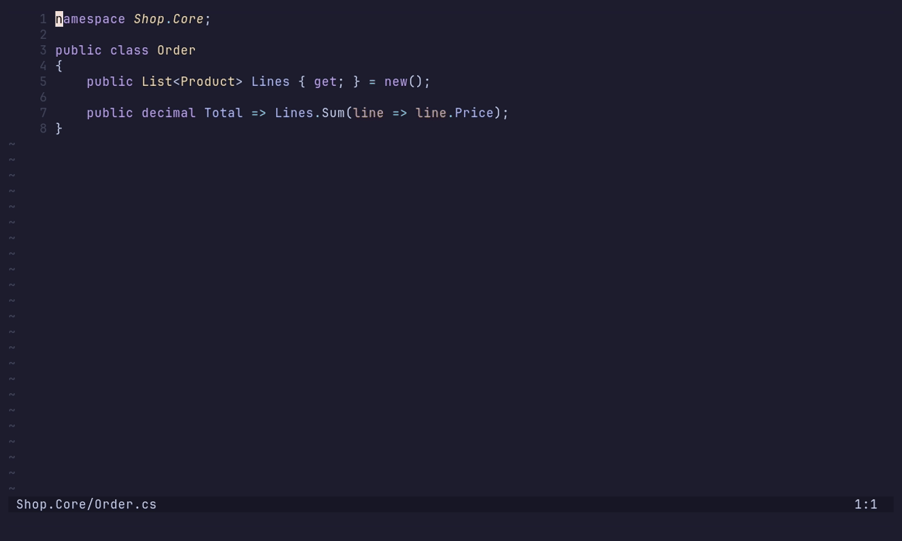

# dotnet-menu.nvim

A small .NET menu for Neovim: solutions, projects, files, project references
and NuGet packages — plus renaming / moving C# files so that the type, the
namespace and the `using` directives follow, across the whole solution.

With [oil.nvim](https://github.com/stevearc/oil.nvim), the same actions run
directly when you create, rename, move or delete a `.cs` file in oil — no menu
needed.

The user interface (menu, prompts, notifications) is in French.



## Requirements

- **Neovim ≥ 0.11** (developed and tested on 0.12).
- **.NET SDK**: `dotnet` on the PATH.
- **roslyn_ls**, for rename / move and the pre-delete check. The plugin relies
  on an LSP client named `roslyn_ls`, the one from the
  [nvim-lspconfig](https://github.com/neovim/nvim-lspconfig) spec:

  ```sh
  dotnet tool install --global roslyn-language-server --prerelease
  ```

  ```lua
  vim.lsp.enable("roslyn_ls")
  ```

  The `roslyn` client from roslyn.nvim is not supported.
- **oil.nvim** (optional), for the actions triggered from oil.

## Installation

With `vim.pack` (Neovim 0.12):

```lua
vim.pack.add({ "https://github.com/ClementLegros/dotnet-menu.nvim" })
require("dotnet-menu").setup()
```

With lazy.nvim:

```lua
{ "ClementLegros/dotnet-menu.nvim", lazy = false, opts = {} }
```

**Do not lazy-load it**: renaming waits for the "solution loaded" signal that
roslyn_ls sends a few seconds after it starts, and only a plugin that is
already set up at that point can see it.

## Configuration

Defaults:

```lua
require("dotnet-menu").setup({
    keymap = "<leader>n",      -- normal-mode key for the menu; false for none
    oil = true,                -- react to file operations saved in oil
    roslyn_diagnostics = true, -- fix errors that linger after a file is added
                               -- to the project (see below)
})
```

The `:Dotnet` command opens the menu too.

## The menu

| Key | Action |
|-----|--------|
| `s` | New solution (`.slnx` by default, `.sln` on request) |
| `p` | New project — 7 common templates + the full catalogue |
| `a` | Add to the solution the projects that exist on disk but are missing from it |
| `f` | New file — class / interface / record / enum / struct |
| `R` | Rename / move the current `.cs` file — its type and namespace follow, everywhere |
| `r` | Project-to-project reference |
| `n` | NuGet package (searches nuget.org) |

Everything goes through the `dotnet` CLI — no daemon, no MSBuild parsing —
except rename / move, which goes through roslyn_ls. Creation prompts accept a
**path**, not just a name: `src/Api` creates the `Api` project under `src/`,
`Services/Billing/Invoice` creates the folders and puts `Invoice.cs` in them.

Two places deliberately do better than the CLI:

- **The namespace.** `dotnet new class` writes `namespace <ProjectRoot>;`,
  ignoring the folders, with no option to fix it, and adds a BOM. The file is
  therefore written directly, with the namespace derived from the folder tree.
- **Reference cycles.** `dotnet add reference` happily accepts a circular
  reference (exit code 0), and the build then fails with `MSB4006`. The menu
  only lists projects that cannot already reach the source project,
  transitively.

## Renaming / moving a file

roslyn_ls only reacts to file renames for `*.razor` files: simply moving
`Foo.cs` would leave the class, and everything that uses it, under the old name
and the old namespace. The `R` menu entry (which takes a name or a path
relative to the file: `Bar`, `Models/Bar`, `../Services/Bar`) and oil therefore
go through roslyn_ls:

1. **Name changed**: the type is renamed (`textDocument/rename`, across the
   solution) while the file is still at its old path.
2. The file is moved.
3. **Folder changed**: the namespace follows, through roslyn's "Change
   namespace" refactoring, which also adds the `using` directives that are
   needed — in the callers, and in the moved file itself if it used types from
   its old folder. roslyn only offers it once the project has reloaded (~2 s),
   so it is awaited in the background.

The modified files are saved.

- **Waiting for the load.** Before it has loaded the solution, roslyn_ls still
  answers, but covering the current file only — with no error (measured). The
  rename therefore waits for `workspace/projectInitializationComplete`.
- **No type with the file's name** (`Program.cs`, a file with several types):
  only the file is renamed, and the notification says so.
- **Buffer with unsaved changes**: the rename is applied to it, but the buffer
  is not saved — a warning names it.
- **Hand-picked namespace**: it is only changed if it followed the old folder.
  Otherwise it is kept, and the notification says so.

## From oil, without the menu

File operations saved in oil (`:w`) directly trigger the matching action for a
`.cs` file inside a project. Rename, move and delete go through roslyn_ls, and
only if it is already running for that solution — no server is started for
the occasion:

| In oil | Effect |
|--------|--------|
| Create `Invoice.cs` | The empty file is filled in: namespace from the folders + `public class Invoice` (`interface` for `IInvoice…`) |
| Rename `Foo.cs` → `Bar.cs` | Type `Foo` renamed to `Bar` across the solution, before oil moves the file |
| Move `Foo.cs` (cut / paste) into `Models/` | Namespace → `…Models`, `using` directives added where needed |
| Delete `Foo.cs` | Warning if `Foo` is still used elsewhere; the deleted file's buffer is closed |

Hooked on the `OilActionsPre` / `OilActionsPost` events. A `.cs` file outside
any project (or whose name is not an identifier, e.g. `Invoice.Validation.cs`)
is left alone.

## roslyn diagnostics (`roslyn_diagnostics`)

When a file is added to the project (created, renamed, moved), already open
buffers that use its type keep a CS0246 error until you `:e` them — even though
the server already knows the type. The cause: on each
`workspace/diagnostic/refresh`, Neovim only re-pulls the "workspace"
diagnostics, not those of each open document. With this option the plugin
re-pulls those too. A handler you defined in your own config is kept: it is
wrapped, not replaced.

The same option works around a Neovim 0.12 bug: once a buffer that received
workspace diagnostics has been wiped (oil does this when it moves a file),
every later refresh fails with `Invalid buffer id`, for the rest of the
session. The stale entries are dropped before each refresh.

## Known limitations

- Tested on Linux (Neovim 0.12, roslyn-language-server 5.12). Windows: not
  tested yet.
- Moving a whole **folder** does not update the namespaces of the files inside
  it.
- Copying a `.cs` file in oil does not rename the type in the copy.

## Demo

The GIF above is recorded with [VHS](https://github.com/charmbracelet/vhs) from
`demo/demo.tape`, on a sample solution created by `demo/setup.sh`:

```sh
demo/setup.sh && vhs demo/demo.tape
```

The demo runs under `NVIM_APPNAME=dotnet-menu-demo`, so it never touches your
own Neovim config or plugins.

## License

MIT
